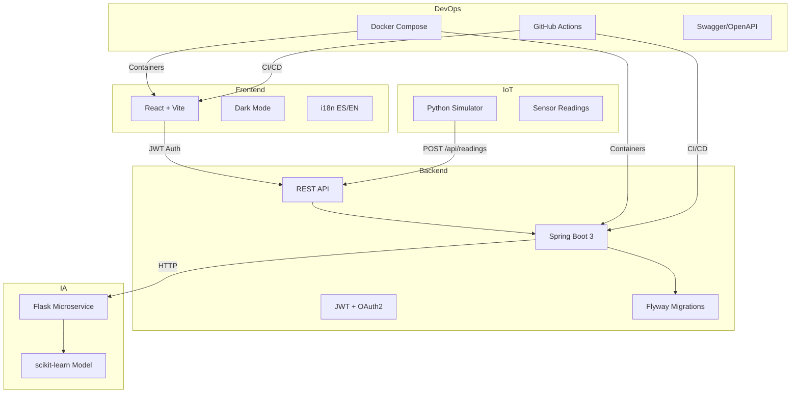

# GreenHouse Manager


Sistema academico para la gestion inteligente de invernaderos agricolas. Combina **Spring Boot**, **React**, **IA predictiva con Flask** y **simulacion IoT** en una plataforma moderna con autenticacion OAuth2, dockerizacion y CI/CD.

---

## Arquitectura



## Stack tecnologico

| Capa | Tecnologia | Version |
|------|-----------|---------|
| Frontend | React + Vite + Lucide | 18 / 8 |
| Backend | Spring Boot + Spring Security | 3.3.5 |
| Base de datos | PostgreSQL (prod) / H2 (test) | 16 |
| ORM | Hibernate + Flyway | — |
| Autenticacion | JWT + OAuth2 Google | — |
| IA | Flask + scikit-learn | 3.11 |
| IoT | Python simulator (requests) | 3.11 |
| Testing | JUnit 5 + Vitest + Selenium + pytest | — |
| CI/CD | GitHub Actions (4 jobs) | — |
| Contenedores | Docker + Docker Compose | — |
| Documentacion API | Swagger/OpenAPI | 2.6.0 |

## Modulos del sistema

| Modulo | Descripcion | Tecnologia |
|--------|-------------|------------|
| `backend/` | API REST: 19 entidades JPA, 6 controllers, 5 servicios | Spring Boot 3 |
| `frontend/` | SPA: 13 componentes, dashboard, dark mode, i18n | React 18 + Vite |
| `frontend/src/config/modelo.json` | Single source of truth para ERD y diccionario | JSON |
| `frontend/src/pages/ERD/` | ERD Viewer con React Flow + Data Dictionary | React Flow |
| `ia/` | Microservicio IA: predicciones y recomendaciones | Flask + scikit-learn |
| `iot/` | Simulador de sensores IoT | Python |
| `tests/python/` | Validacion del modelo JSON | Python unittest |
| `docs/` | Documentacion: ER, diccionario, mockups, API | Markdown |
| `.github/workflows/` | CI/CD: 4 jobs de validacion | GitHub Actions |

## Inicio rapido

```bash
# 1. Clonar e iniciar todo con Docker
git clone https://github.com/.../greenhouse.git
cd greenhouse
docker compose up --build

# 2. Acceder
# Frontend: http://localhost:5173
# Backend:  http://localhost:8080
# Swagger:  http://localhost:8080/swagger-ui.html
# Health:   http://localhost:8080/api/health

# 3. Login: admin@greenhouse.local / admin1234

# 4. IA (opcional, en otra terminal)
cd ia
pip install -r requirements.txt
python app.py
# Flask en http://localhost:5000

# 5. IoT Simulator (opcional)
cd iot
pip install requests
python simulador.py --interval 5
```

## API REST (Swagger)

La documentacion interactiva esta disponible en `/swagger-ui.html` con el backend corriendo.

### Endpoints principales

| Metodo | Ruta | Auth | Descripcion |
|--------|------|------|-------------|
| POST | `/api/auth/login` | Publico | Iniciar sesion (JWT) |
| POST | `/api/auth/register` | Publico | Registrar usuario |
| POST | `/api/auth/refresh` | JWT | Refrescar token |
| POST | `/api/auth/forgot-password` | Publico | Recuperar password |
| POST | `/api/auth/reset-password` | Token | Restablecer password |
| POST | `/api/auth/verify` | Publico | Verificar email |
| GET | `/api/greenhouses` | JWT | Listar invernaderos |
| POST | `/api/greenhouses` | ADMIN | Crear invernadero |
| GET | `/api/readings` | JWT | Obtener lecturas |
| POST | `/api/readings` | OPERATOR | Registrar lectura |
| PATCH | `/api/alerts/{id}/resolve` | OPERATOR | Resolver alerta |
| GET | `/api/ia/health` | JWT | Estado IA |
| POST | `/api/ia/predict` | JWT | Predecir temperatura/humedad |
| POST | `/api/ia/recommend` | JWT | Recomendar accion |
| GET | `/api/health` | Publico | Health check del sistema |

### Seguridad por roles

| Rol | Acceso |
|-----|--------|
| `VIEWER` | Lectura de datos, dashboard, IA |
| `OPERATOR` | Lectura + escritura sensores, alertas, riegos |
| `ADMIN` | Acceso completo: usuarios, configuracion, CRUD invernaderos |

## Internacionalizacion (i18n)

El sistema soporta **español (es)** e **ingles (en)** de forma completa, tanto en frontend como backend.

### Arquitectura i18n

**Frontend (React)**
- Diccionario centralizado en `frontend/src/i18n.js` con estructura plana y backward-compatible.
- Helper `translate(language, path, fallback)` para migracion gradual a namespaces (e.g. `auth.login`).
- Persistencia de idioma en `localStorage` via `getSavedLanguage()` / `saveLanguage()`.
- El header `Accept-Language` se envia automaticamente en cada request API segun el idioma seleccionado.
- Componentes reciben el objeto `t = dictionary[language]` como prop; todos los textos quemados fueron eliminados.

**Backend (Spring Boot)**
- `ResourceBundleMessageSource` configurado en `InternationalizationConfig` con fallback deshabilitado al locale del sistema (`setFallbackToSystemLocale(false)`).
- `AcceptHeaderLocaleResolver` resuelve el idioma desde el header `Accept-Language`.
- Todos los servicios usan `LocaleContextHolder.getLocale()` (NO `Locale.getDefault()`).
- Controladores inyectan `Locale locale` y pasan mensajes traducidos en responses y excepciones.
- Validaciones (`@NotBlank`, etc.) usan claves de mensaje: `{validation.email.required}`.
- Archivos de propiedades:
  - `messages.properties` — idioma por defecto (ingles)
  - `messages_es.properties` — español

### Flujo end-to-end

```
Usuario selecciona idioma → localStorage
     ↓
React lee localStorage → renderiza traducciones
     ↓
API requests incluyen Accept-Language: es|en
     ↓
Spring Boot resuelve locale → MessageSource → response traducida
```

### Tests i18n

- **Frontend**: `frontend/src/__tests__/i18n.test.jsx` valida persistencia, cambio dinamico y parity de keys.
- **Backend**: `backend/src/test/java/.../web/I18nIntegrationTest.java` valida `Accept-Language` es/en y traduccion de errores.

## Flujo IA

```
Frontend (IaSection.jsx)
  → Obtiene lecturas históricas de sensores
  → POST /api/ia/predict
    → IaService (proxy HTTP)
      → Flask microservicio (scikit-learn)
        → Predicción: temperatura, humedad, tendencia
  → POST /api/ia/recommend
    → Recomendación agronómica basada en riesgo

Predicción local alternativa (AiPredictionService):
  → Media móvil ponderada + proyección lineal
  → Evaluación de riesgo (HIGH/MEDIUM/LOW)
  → Sin dependencia externa
```

## Simulador IoT

```
SimulationService.tick() cada 5s (vía @Scheduled)
  → SensorState.nextValue() genera valor gradual
    → 5% de probabilidad de anomalía
    → Tendencia cambia cada 5 ticks
    → Soft bounce en límites
  → Lectura persistida en PostgreSQL
  → RuleEngineService.evaluateReading()
    → Verificación de umbrales → alertas
    → Evaluación de reglas LOW_HUMIDITY_IRRIGATION
      → Activación/desactivación de actuadores
      → Creación de eventos de riego
```

## Estructura del Proyecto

```
GreenHouse/
├── backend/           # Spring Boot 3 REST API
│   ├── src/main/java  # Código fuente (10 services, 6 controllers, 19 entidades)
│   ├── src/main/resources/  # Configuración, mensajes i18n, Flyway
│   └── src/test/java  # Tests JUnit (48 tests)
├── frontend/          # React + Vite SPA
│   ├── src/components/ # 20 componentes React
│   ├── src/pages/ERD/ # Visor ERD con React Flow
│   └── src/config/    # Modelo JSON y parser
├── ia/                # Flask IA microservicio
├── iot/               # Simulador Python IoT
├── docs/              # Documentación del proyecto
├── .github/workflows/ # CI/CD (4 jobs)
└── docker-compose.yml # Orquestación Docker
```

## Documentación

| Archivo | Contenido |
|---------|-----------|
| `docs/architecture.md` | Arquitectura completa del sistema |
| `docs/backend.md` | Documentación del backend |
| `docs/frontend.md` | Documentación del frontend |
| `docs/api.md` | Endpoints REST completos |
| `docs/testing.md` | Guía de pruebas |
| `docs/security.md` | Seguridad: JWT, OAuth, roles |
| `docs/troubleshooting.md` | Solución de problemas comunes |
| `docs/devops.md` | Integración DevOps completa |
| `docs/taiga-integration.md` | Integración con Taiga.io |
| `docs/traceability.md` | Matriz de trazabilidad del proyecto |
| `docs/ci-cd.md` | Pipeline CI/CD completo |
| `.github/workflows/ci.yml` | CI: 5 jobs con Jacoco + artifacts |
| `.github/workflows/taiga-sync.yml` | Sincronización real Taiga.io |
| `.github/workflows/security.yml` | CodeQL + Dependency Review |
| `.github/workflows/release.yml` | Build + changelog + release |
| `.github/changelog-config.json` | Config changelog automático |
| `CHANGELOG.md` | Registro de cambios

## Pruebas

```bash
# Backend (JUnit 5 + MockMvc)
cd backend && mvn test

# Frontend (Vitest)
cd frontend && npm test

# Frontend (Selenium E2E)
cd frontend && npm run test:selenium

# IA (pytest)
cd ia && pytest

# Validacion modelo JSON
python -m unittest discover -s tests/python

# ERD + Data Dictionary tests (Vitest)
cd frontend && npx vitest run src/pages/ERD/__tests__/

# ERD Selenium E2E
cd frontend && node test/selenium/erd.test.js

# CI/CD (GitHub Actions)
# Push a main/master ejecuta automaticamente:
# - Backend JUnit
# - Frontend Vitest + ESLint + Build
# - Python Model Validation
# - Python IA Tests
```

## Despliegue

| Servicio | Plataforma | Documentacion |
|----------|-----------|---------------|
| Frontend | Vercel | `DEPLOY.md` |
| Backend | Railway | `DEPLOY.md` |
| Base de datos | Neon PostgreSQL | `DEPLOY.md` |
| IA | Render o Railway | `DEPLOY.md` |

## Documentacion adicional

| Archivo | Contenido |
|---------|-----------|
| `docs/entidad-relacion.md` | Diagrama entidad-relacion (Mermaid) |
| `docs/diccionario-datos.md` | Diccionario de datos completo |
| `docs/modelo-invernadero.json` | Modelo JSON de datos |
| `docs/ia.md` | Arquitectura del modulo IA |
| `docs/iot.md` | Arquitectura del simulador IoT |
| `docs/api.md` | Documentacion de endpoints |
| `docs/mockups/` | Screenshots del sistema |
| `docs/taiga-historias.md` | Historias de usuario (Taiga) |
| `DEPLOY.md` | Guia completa de despliegue |
| `frontend/src/config/modelo.json` | Single source of truth del modelo de datos |
| `frontend/src/config/modelParser.js` | Parser automatico: FK detection, edges, relaciones, cardinalidades |
| `frontend/src/pages/ERD/` | ERD Viewer (React Flow) y Data Dictionary dinamico |

## Evidencia academica

- **Swagger/OpenAPI**: Documentacion interactiva en `/swagger-ui.html`
- **GitHub Actions**: Pipeline CI/CD con 4 jobs de validacion
- **Testing**: JUnit (48 tests), Vitest (39 tests), pytest (8 tests), Selenium (6 tests)
- **Docker**: `docker compose up --build` levanta el sistema completo
- **IA**: Predicciones con regresion lineal (scikit-learn)
- **IoT**: Simulacion de sensores con generacion de anomalias
- **Auth**: JWT + OAuth2 Google + Refresh tokens + Verify email + Forgot password
- **ERD Dinamico**: Diagrama entidad-relacion generado desde `modelo.json` con React Flow
- **Data Dictionary**: Diccionario de datos dinamico con FK, PK, enums, validaciones
- **Parser Automatico**: Deteccion de FK, generacion de edges y cardinalidades desde JSON
- **Exportacion**: Exportacion de metadata a JSON y Schema SQL

---

**Proyecto academico — Ingenieria de Sistemas**
