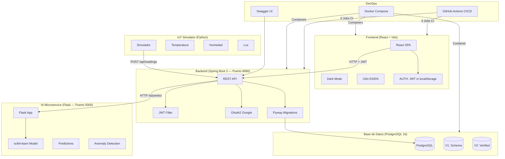
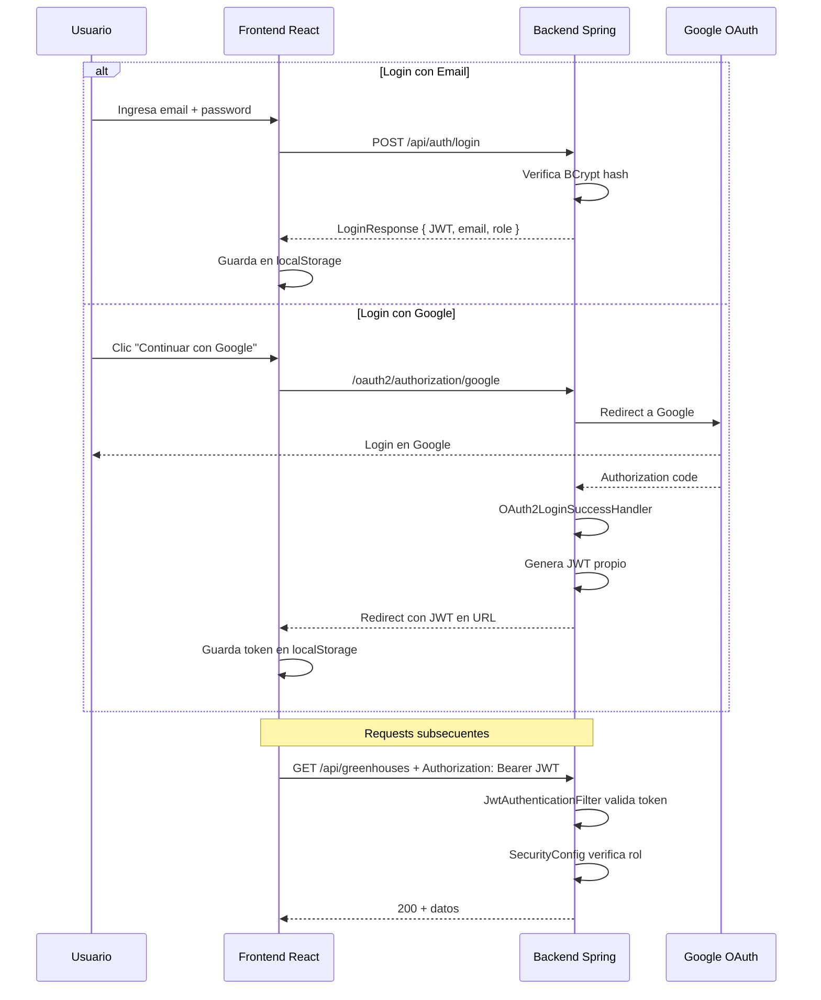
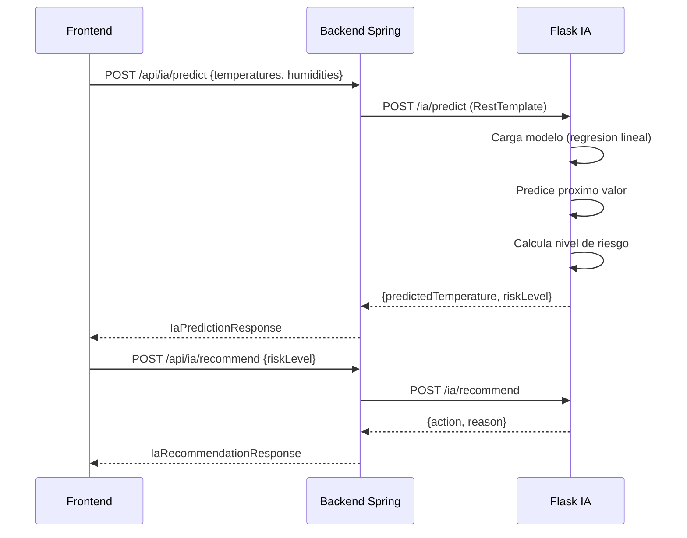
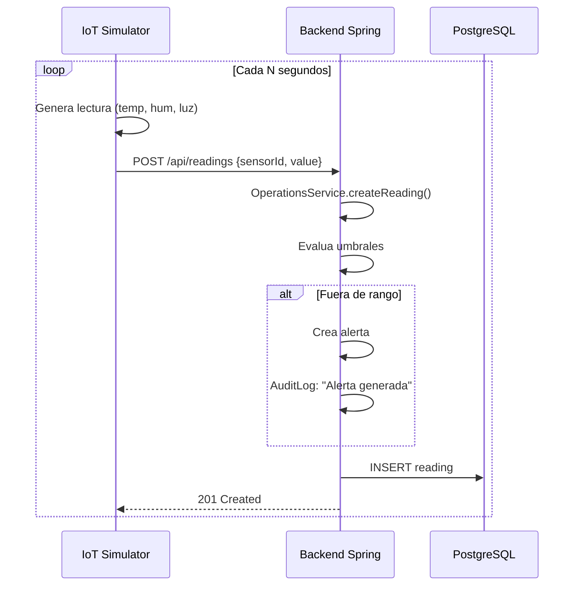
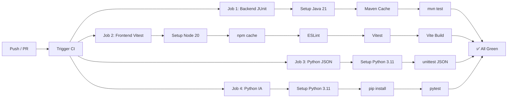
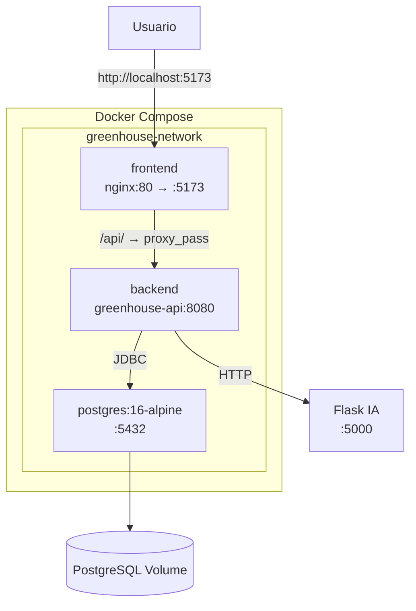
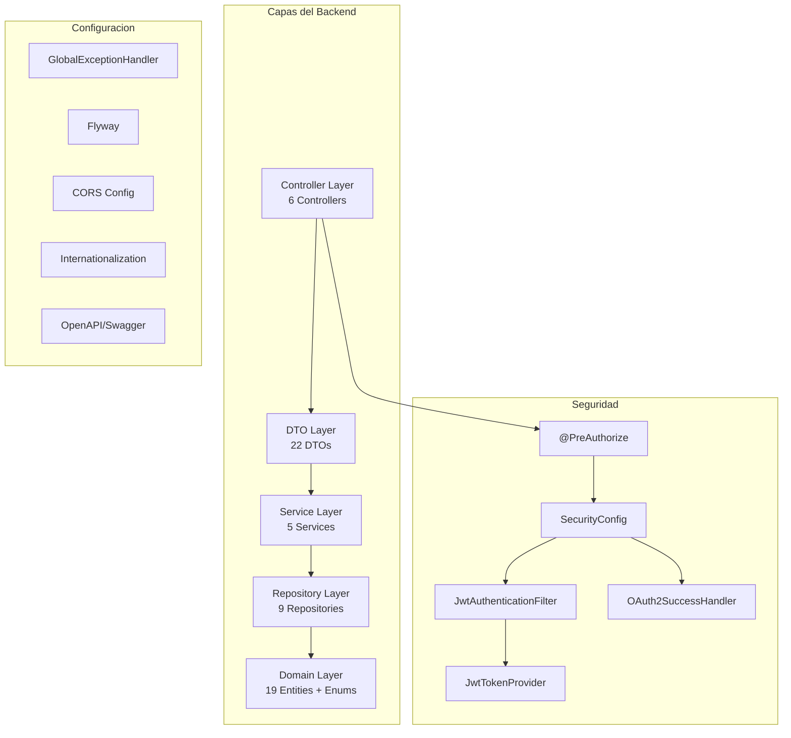
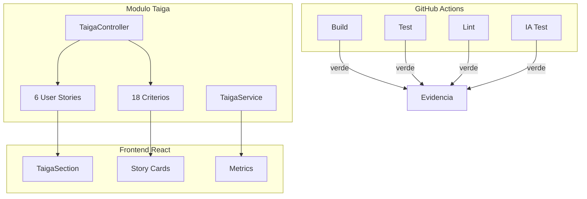

# Diagramas de Arquitectura — GreenHouse Manager

## 1. Arquitectura General

## 2. Flujo de Autenticacion (OAuth2 + JWT)

## 3. Flujo IA (Flask + scikit-learn)

## 4. Flujo IoT (Simulador de Sensores)

## 5. Pipeline CI/CD (GitHub Actions)

## 6. Arquitectura Docker

## 7. Arquitectura Backend (Spring Boot)

## 8. Flujo de Automatizacion Taiga

