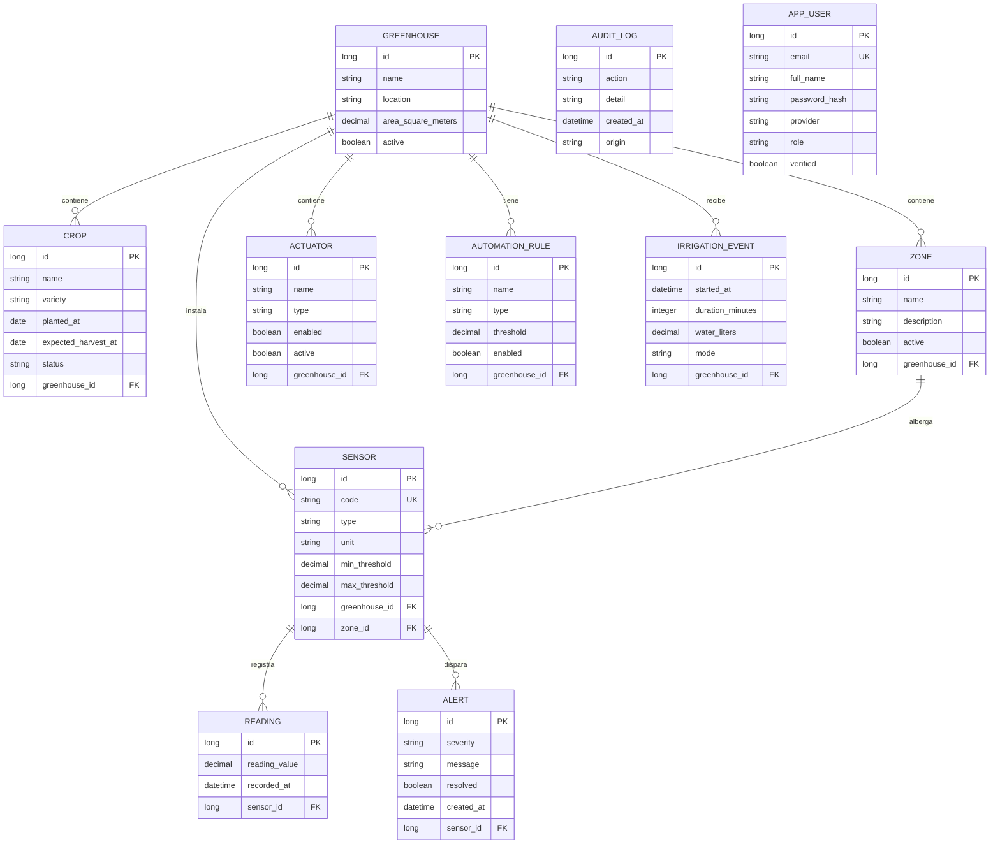

# Entidad-Relacion

## Diagrama Entidad-Relacion (ERD)

## Relaciones

| Entidad Origen | Entidad Destino | Tipo | FK | Cardinalidad | Descripcion |
|----------------|-----------------|------|-----|-------------|-------------|
| Greenhouse | Crop | OneToMany | greenhouse_id | 1:N | Un invernadero contiene muchos cultivos |
| Greenhouse | Sensor | OneToMany | greenhouse_id | 1:N | Un invernadero instala muchos sensores |
| Greenhouse | Zone | OneToMany | greenhouse_id | 1:N | Un invernadero contiene muchas zonas |
| Greenhouse | Actuator | OneToMany | greenhouse_id | 1:N | Un invernadero tiene muchos actuadores |
| Greenhouse | AutomationRule | OneToMany | greenhouse_id | 1:N | Un invernadero tiene muchas reglas |
| Greenhouse | IrrigationEvent | OneToMany | greenhouse_id | 1:N | Un invernadero recibe muchos riegos |
| Sensor | Reading | OneToMany | sensor_id | 1:N | Un sensor registra muchas lecturas |
| Sensor | Alert | OneToMany | sensor_id | 1:N | Un sensor dispara muchas alertas |
| Zone | Sensor | OneToMany | zone_id | 1:N | Una zona alberga muchos sensores |
| Crop | Greenhouse | ManyToOne | greenhouse_id | N:1 | Muchos cultivos pertenecen a un invernadero |
| Sensor | Greenhouse | ManyToOne | greenhouse_id | N:1 | Muchos sensores pertenecen a un invernadero |
| Sensor | Zone | ManyToOne | zone_id | N:1 | Muchos sensores pertenecen a una zona |
| Reading | Sensor | ManyToOne | sensor_id | N:1 | Muchas lecturas pertenecen a un sensor |
| IrrigationEvent | Greenhouse | ManyToOne | greenhouse_id | N:1 | Muchos riegos pertenecen a un invernadero |
| Alert | Sensor | ManyToOne | sensor_id | N:1 | Muchas alertas pertenecen a un sensor |
| Actuator | Greenhouse | ManyToOne | greenhouse_id | N:1 | Muchos actuadores pertenecen a un invernadero |
| AutomationRule | Greenhouse | ManyToOne | greenhouse_id | N:1 | Muchas reglas pertenecen a un invernadero |
| Zone | Greenhouse | ManyToOne | greenhouse_id | N:1 | Muchas zonas pertenecen a un invernadero |
