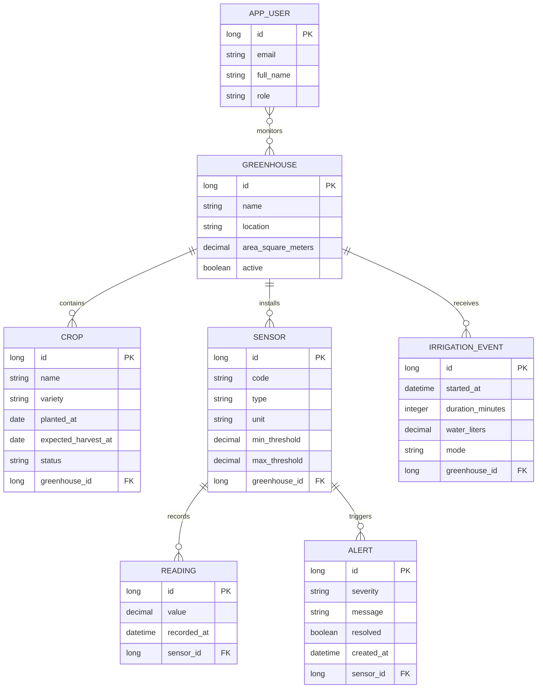

# Entidad Relacion

```mermaid
erDiagram
  GREENHOUSE ||--o{ CROP : contains
  GREENHOUSE ||--o{ SENSOR : installs
  GREENHOUSE ||--o{ IRRIGATION_EVENT : receives
  SENSOR ||--o{ READING : records
  SENSOR ||--o{ ALERT : triggers
  APP_USER }o--o{ GREENHOUSE : monitors

  GREENHOUSE {
    long id PK
    string name
    string location
    decimal area_square_meters
    boolean active
  }

  CROP {
    long id PK
    string name
    string variety
    date planted_at
    date expected_harvest_at
    string status
    long greenhouse_id FK
  }

  SENSOR {
    long id PK
    string code
    string type
    string unit
    decimal min_threshold
    decimal max_threshold
    long greenhouse_id FK
  }

  READING {
    long id PK
    decimal value
    datetime recorded_at
    long sensor_id FK
  }

  IRRIGATION_EVENT {
    long id PK
    datetime started_at
    integer duration_minutes
    decimal water_liters
    string mode
    long greenhouse_id FK
  }

  ALERT {
    long id PK
    string severity
    string message
    boolean resolved
    datetime created_at
    long sensor_id FK
  }

  APP_USER {
    long id PK
    string email
    string full_name
    string role
  }
```
